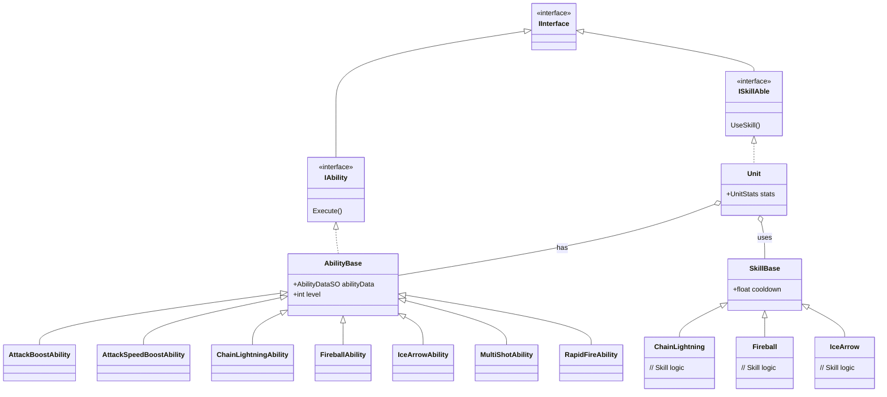

```mermaid
classDiagram
    direction TB

    class IInterface {
        <<interface>>
    }

    class IAbility {
        <<interface>>
        Execute()
    }
    
    class ISkillAble {
        <<interface>>
        UseSkill()
    }

    IInterface <|-- IAbility
    IInterface <|-- ISkillAble

    class Unit {
        +UnitStats stats
    }
    ISkillAble <|.. Unit

    class AbilityBase {
        +AbilityDataSO abilityData
        +int level
    }
    IAbility <|.. AbilityBase

    class AttackBoostAbility {}
    AbilityBase <|-- AttackBoostAbility

    class AttackSpeedBoostAbility {}
    AbilityBase <|-- AttackSpeedBoostAbility

    class ChainLightningAbility {}
    AbilityBase <|-- ChainLightningAbility

    class FireballAbility {}
    AbilityBase <|-- FireballAbility

    class IceArrowAbility {}
    AbilityBase <|-- IceArrowAbility

    class MultiShotAbility {}
    AbilityBase <|-- MultiShotAbility
    
    class RapidFireAbility {}
    AbilityBase <|-- RapidFireAbility

    class SkillBase {
        +float cooldown
    }
    
    class ChainLightning {
        // Skill logic
    }
    SkillBase <|-- ChainLightning
    
    class Fireball {
        // Skill logic
    }
    SkillBase <|-- Fireball
    
    class IceArrow {
        // Skill logic
    }
    SkillBase <|-- IceArrow
    
    Unit o-- AbilityBase : has
    Unit o-- SkillBase : uses
```
