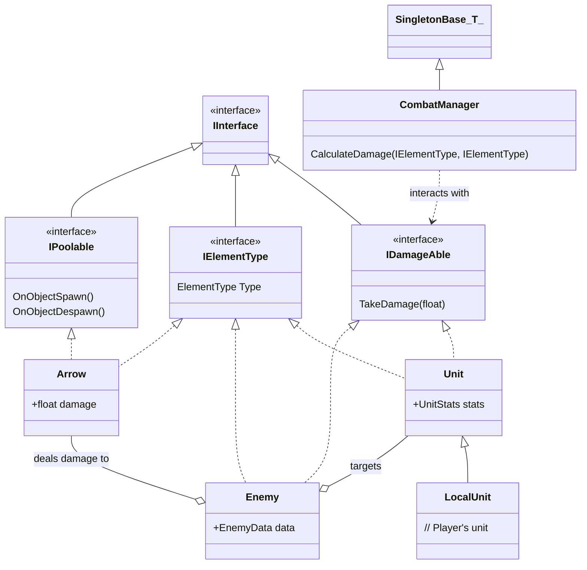

```mermaid
classDiagram
    direction TB

    class IInterface {
        <<interface>>
    }

    class IDamageAble {
        <<interface>>
        TakeDamage(float)
    }

    class IElementType {
        <<interface>>
        ElementType Type
    }
    
    class IPoolable {
        <<interface>>
        OnObjectSpawn()
        OnObjectDespawn()
    }
    
    IInterface <|-- IDamageAble
    IInterface <|-- IElementType
    IInterface <|-- IPoolable

    class Unit {
        +UnitStats stats
    }
    IDamageAble <|.. Unit
    IElementType <|.. Unit
    
    class LocalUnit {
        // Player's unit
    }
    Unit <|-- LocalUnit

    class Enemy {
        +EnemyData data
    }
    IDamageAble <|.. Enemy
    IElementType <|.. Enemy

    class Arrow {
        +float damage
    }
    IPoolable <|.. Arrow
    IElementType <|.. Arrow
    
    class CombatManager {
        CalculateDamage(IElementType, IElementType)
    }
    SingletonBase_T_ <|-- CombatManager

    CombatManager ..> IDamageAble : interacts with
    Unit --o Enemy : targets
    Arrow --o Enemy : deals damage to

```
