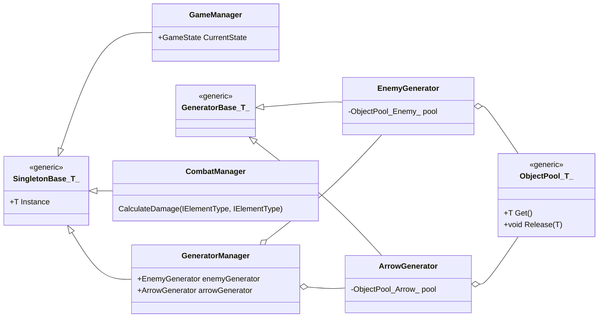

```mermaid
classDiagram
    direction LR
    
    class SingletonBase_T_ {
        <<generic>>
        +T Instance
    }

    class ObjectPool_T_ {
        <<generic>>
        +T Get()
        +void Release(T)
    }

    class GameManager {
        +GameState CurrentState
    }
    
    class GeneratorManager {
        +EnemyGenerator enemyGenerator
        +ArrowGenerator arrowGenerator
    }
    
    class CombatManager {
        CalculateDamage(IElementType, IElementType)
    }
    
    SingletonBase_T_ <|-- GameManager
    SingletonBase_T_ <|-- GeneratorManager
    SingletonBase_T_ <|-- CombatManager

    class GeneratorBase_T_ {
        <<generic>>
    }

    class EnemyGenerator {
        -ObjectPool_Enemy_ pool
    }

    class ArrowGenerator {
        -ObjectPool_Arrow_ pool
    }
    
    GeneratorBase_T_ <|-- EnemyGenerator
    GeneratorBase_T_ <|-- ArrowGenerator

    GeneratorManager o-- EnemyGenerator
    GeneratorManager o-- ArrowGenerator
    
    EnemyGenerator o-- ObjectPool_T_
    ArrowGenerator o-- ObjectPool_T_
```