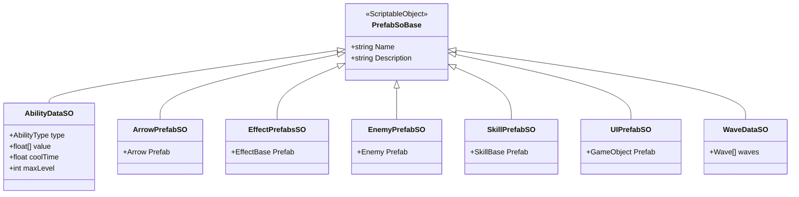

```mermaid
classDiagram
    direction TB
    
    class PrefabSoBase {
        <<ScriptableObject>>
        +string Name
        +string Description
    }

    class AbilityDataSO {
        +AbilityType type
        +float[] value
        +float coolTime
        +int maxLevel
    }
    PrefabSoBase <|-- AbilityDataSO

    class ArrowPrefabSO {
        +Arrow Prefab
    }
    PrefabSoBase <|-- ArrowPrefabSO

    class EffectPrefabsSO {
        +EffectBase Prefab
    }
    PrefabSoBase <|-- EffectPrefabsSO
    
    class EnemyPrefabSO {
        +Enemy Prefab
    }
    PrefabSoBase <|-- EnemyPrefabSO
    
    class SkillPrefabSO {
        +SkillBase Prefab
    }
    PrefabSoBase <|-- SkillPrefabSO
    
    class UIPrefabSO {
        +GameObject Prefab
    }
    PrefabSoBase <|-- UIPrefabSO

    class WaveDataSO {
        +Wave[] waves
    }
    PrefabSoBase <|-- WaveDataSO
```
