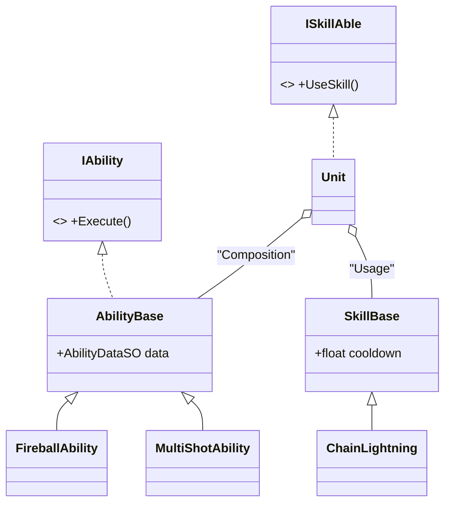

# [기술 문서] 전략 패턴 기반 확장형 능력 및 스킬 시스템 (Ability & Skill System)

## 1. 시스템 개요 (System Overview)

* **기능 도입 배경:** 
  유닛의 지속 효과(패시브)와 사용 효과(액티브)를 효율적으로 조합하고 확장하기 위한 시스템입니다. 캐릭터 로직과 실제 능력 실행 로직을 분리하여 기획 변경에 유연하게 대응하고, 코드의 재사용성을 높이는 것을 목표로 합니다.
  
* **구현 목표:**
  * **구조적 유연성:** 유닛 클래스를 수정하지 않고 능력을 조립하여 기능을 확장하는 구조 설계.
  * **데이터 주도 방식:** `ScriptableObject`를 활용해 능력의 수치와 설정을 외부에서 관리하도록 구현.
  * **객체지향 원칙 준수:** 새로운 능력 추가 시 기존 코드를 변경하지 않는 '개방-폐쇄 원칙' 적용.

## 2. 시스템 구조 (Architecture)

능력 실행 로직을 인터페이스로 추상화하여 유닛과의 의존성을 최소화했습니다.



**[구조 상세 설명]**
*   **전략 패턴 (Strategy Pattern):** `IAbility` 인터페이스를 통해 실제 능력의 실행 로직을 캡슐화했습니다. 유닛은 구체적인 능력의 내용을 몰라도 동일한 방식으로 실행할 수 있습니다.
*   **합성 (Composition) 활용:** 유닛 클래스가 직접 능력을 상속받지 않고, 능력 객체들을 리스트 형태로 소유(Has-a)함으로써 런타임에 유연하게 능력을 추가하거나 제거할 수 있는 구조를 취했습니다.
*   **계층적 클래스 설계:** `AbilityBase`와 `SkillBase` 추상 클래스를 통해 공통 데이터(SO 참조, 쿨타임 등)를 관리하고, 하위 클래스에서 실제 효과만 구현하도록 역할 분담을 명확히 했습니다.

## 3. 핵심 기능 및 동작 방식 (Core Logic)

### [전략 패턴을 활용한 능력 실행]
유닛은 실행할 능력의 상세 로직을 알지 못하며, 소유한 `IAbility` 리스트를 순회하며 `Execute()`를 호출합니다. 각 능력은 독립된 클래스에서 정의되어 있어 코드 관리 효율이 높습니다.

```csharp
// AbilityBase.cs (전략 추상 클래스)
public abstract class AbilityBase : MonoBehaviour, IAbility
{
    public AbilityDataSO abilityData; // 데이터 참조
    public int level;

    public abstract void Execute(); // 하위 클래스에서 효과 정의
}

// MultiShotAbility.cs (구체적 전략 예시)
public class MultiShotAbility : AbilityBase
{
    public override void Execute()
    {
        // 화살 발사 개수를 조정하는 로직 실행
        // 유닛의 핵심 로직과는 분리되어 동작
    }
}
```

## 4. 고민과 선택 (Trade-offs)

| 비교 항목 | A안: 직접 구현 (Hard-coded) | B안: 전략 패턴 기반 (Strategy Pattern) |
| :--- | :--- | :--- |
| **구현 속도** | 초기 설계 단계에서 빠르게 결과물을 확인할 수 있음. | 인터페이스 및 클래스 구조 설계에 추가 시간이 소요됨. |
| **유지보수성** | 스킬 수가 늘어날수록 유닛 클래스의 복잡도가 급격히 증가함. | 기능별로 클래스가 분리되어 있어 수정 및 관리가 용이함. |
| **확장성** | 새로운 스킬 추가 시 기존 유닛 코드 수정이 필요함. | 기존 코드 수정 없이 신규 클래스 추가만으로 기능 확장 가능. |

*   **선택 이유:** **B안(전략 패턴 기반)**을 선택했습니다. 디펜스 게임의 특성상 다수의 스킬과 능력이 추가될 가능성이 높으며, 초기 설계 비용을 감수하더라도 코드의 안정성과 관리 효율을 확보하는 것이 장기적으로 유리하다고 판단했습니다.

## 5. 회고 (Retrospective)

* **문제 인식:** 
  현재 구조는 각 능력이 독립적으로 동작하므로 능력 간의 상호작용(예: 빙결 후 화염 공격 시 시너지 효과)을 처리하는 로직이 다소 복잡해질 수 있는 구조적 한계가 있습니다.

* **향후 개선 방안:** 
  **'이벤트 시스템'** 또는 **'중앙 조정자(Mediator)'**를 도입하여 능력 간의 시너지를 중앙에서 제어하고, 객체 간 직접적인 참조 없이도 복합적인 효과를 구현할 수 있도록 개선할 계획입니다.
