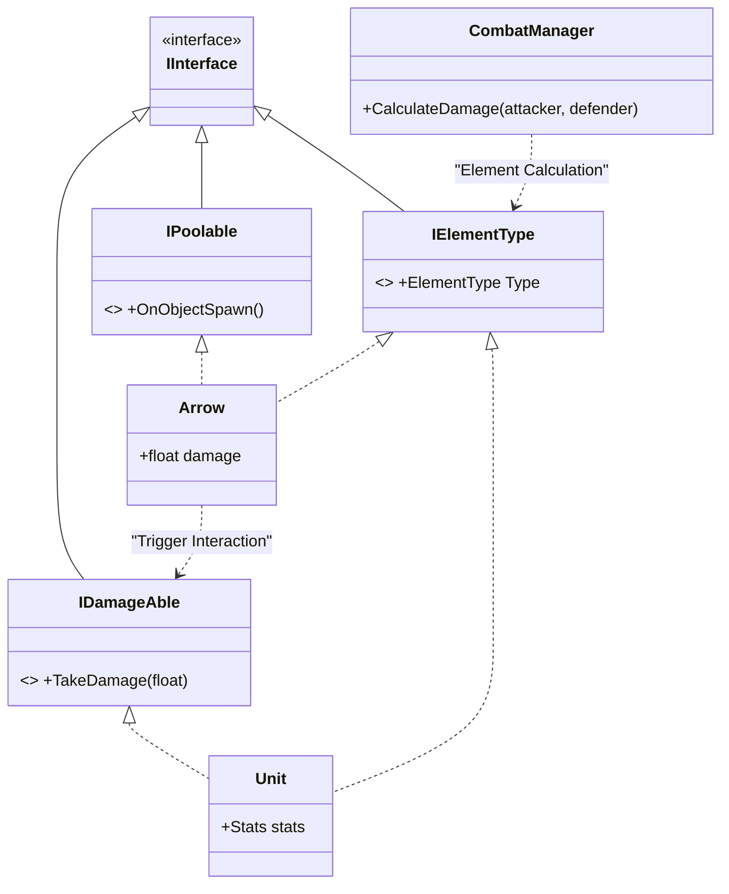

# [기술 문서] 인터페이스 기반 속성 전투 및 투사체 시스템 (Arrow Combat System)

## 1. 시스템 개요 (System Overview)

* **기능 도입 배경:** 
  'ArrowGuardian'은 다수의 적과 투사체가 실시간으로 상호작용하는 디펜스 장르입니다. 다양한 속성 조합을 통한 전략적 요소와 대규모 교전 환경에서도 안정적인 퍼포먼스를 유지할 수 있는 경량화된 전투 로직이 필요했습니다. 속성 간 상성 계산을 구조적으로 처리하여 유지보수성을 확보하고자 했습니다.
  
* **구현 목표:**
  * **구조적 확장성:** 인터페이스(`IElementType`)를 활용하여 속성 조합 추가 시 기존 코드의 수정을 최소화하도록 설계.
  * **런타임 퍼포먼스 관리:** 대량의 투사체 충돌 시 발생하는 연산 부하를 줄이기 위해 인터페이스 기반의 직접 참조 방식 채택.
  * **의존성 분리:** 화살 객체가 타겟의 구체적인 타입을 참조하지 않고 인터페이스를 통해 데미지를 전달하는 구조 확립.

## 2. 시스템 구조 (Architecture)

다형성을 활용하여 구체 클래스 간의 결합도를 낮추고 인터페이스를 중심으로 상호작용하도록 설계되었습니다.



**[구조 상세 설명]**
*   **인터페이스 분리 (ISP):** 데미지 수용(`IDamageAble`), 속성 정보(`IElementType`), 풀링 제어(`IPoolable`) 기능을 독립된 인터페이스로 분리하여 객체가 필요한 기능만 선택적으로 구현할 수 있게 설계했습니다.
*   **추상화된 상호작용:** 화살(Arrow)은 유닛(Unit)의 구체 클래스가 아닌 인터페이스를 참조하여 충돌을 처리하므로, 새로운 타입의 적이 추가되어도 기존 전투 로직을 재사용할 수 있습니다.
*   **중앙 집중식 계산:** `CombatManager`가 인터페이스를 통해 양측의 속성 정보를 전달받아 상성 데미지를 일괄 계산함으로써 로직의 응집도를 높였습니다.

## 3. 핵심 기능 및 동작 방식 (Core Logic)

### [인터페이스 기반 데미지 전달 방식]
화살 객체는 충돌 대상의 구체적인 클래스 타입을 검사하지 않습니다. 대신 `IDamageAble` 인터페이스 소유 여부만 확인하여 데미지를 전달함으로써, 적 유닛뿐만 아니라 파괴 가능한 모든 오브젝트에 동일한 로직을 적용할 수 있습니다.

```csharp
// Arrow.cs (인터페이스 참조 로직)
private void OnTriggerEnter2D(Collider2D collision)
{
    // 1. 데미지 수용 가능 인터페이스 확인
    if (collision.TryGetComponent<IDamageAble>(out var target))
    {
        // 2. 속성 정보 확인 및 상성 데미지 계산
        collision.TryGetComponent<IElementType>(out var targetElement);
        float finalDamage = CombatManager.Instance.CalculateDamage(this, targetElement);
        
        target.TakeDamage(finalDamage);
        
        // 3. 오브젝트 풀 반납
        gameObject.SetActive(false); 
    }
}
```

## 4. 고민과 선택 (Trade-offs)

구현 과정에서 **'상속을 통한 통합 관리'**와 **'인터페이스를 통한 기능 분리'**의 효율성을 비교하였습니다.

| 비교 항목 | A안: 상속 기반 (Base Class) | B안: 인터페이스 기반 (Interface) |
| :--- | :--- | :--- |
| **유연성** | 부모 클래스 수정 시 모든 하위 클래스에 영향이 가며 다중 상속이 제한됨. | 필요한 기능(속성, 데미지 등)을 독립적으로 구성하여 컴포넌트 단위 적용 가능. |
| **결합도** | 특정 베이스 클래스에 대한 참조가 필요하여 클래스 간 의존성이 높아짐. | 인터페이스 규격만 맞추면 되므로 객체 간 결합도가 낮아짐. |
| **적용 범위** | 유사한 기능을 가진 클래스들로 적용이 국한됨. | 데미지를 입거나 속성을 가진 모든 객체에 범용적으로 적용 가능. |

*   **선택 이유:** **B안(인터페이스 기반)**을 선택했습니다. 프로젝트 확장 시 '속성은 있지만 데미지는 입지 않는 오브젝트' 등 기획적 예외 상황이 발생할 가능성이 높으며, 인터페이스 기반 구조가 이러한 변화에 더 유연하게 대응할 수 있다고 판단했습니다. `TryGetComponent` 호출 비용은 오브젝트 풀링을 통한 최적화로 관리 가능한 수준임을 확인했습니다.

## 5. 회고 (Retrospective)

* **문제 인식:** 
  현재 `CombatManager`에서 데미지 계산 시 매번 `TryGetComponent`를 호출하고 있습니다. 프레임당 다수의 충돌이 발생하는 상황에서는 해당 호출이 누적되어 연산 오버헤드가 발생할 가능성이 있습니다.

* **향후 개선 방안:** 
  1. **정보 캐싱:** 객체 생성 시 자신의 속성 정보를 변수에 미리 저장하여 충돌 시의 연산 횟수를 줄일 계획입니다.
  2. **데이터 주도 설계:** 속성 상성 수치를 코드와 분리하여 `ScriptableObject` 등 외부 데이터에서 관리함으로써 밸런스 수정의 용이성을 확보할 예정입니다.

## 6. 개발 이슈 및 해결 방안 (Troubleshooting)

* **이슈:** 오브젝트 풀에서 재사용되는 화살이 이전 발사 시의 물리 값을 유지하여 궤적이 비정상적으로 생성되는 현상.
* **원인:** 활성화(`OnObjectSpawn`) 시점에 리지드바디의 속도와 회전값 초기화가 누락되어 잔존 물리 에너지가 적용됨.
* **해결:** `IPoolable.OnObjectSpawn` 메서드 내에 리지드바디의 상태 초기화 로직을 추가하여 해결했습니다.
