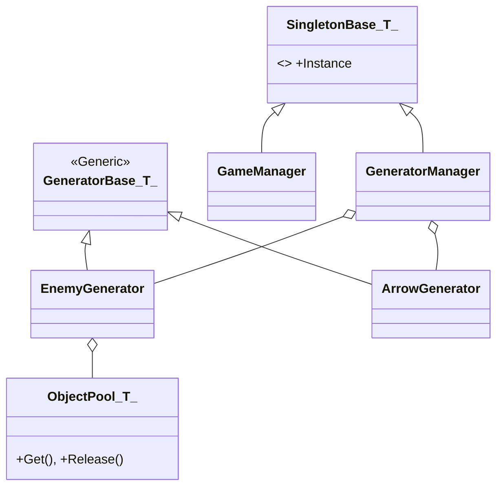

# [기술 문서] 중앙 관리 및 오브젝트 풀링 시스템 (Core Management & Pooling)

## 1. 시스템 개요 (System Overview)

* **기능 도입 배경:** 
  디펜스 게임 특성상 대량의 유닛과 투사체가 빈번하게 생성되고 파괴됩니다. `Instantiate`와 `Destroy`의 반복적인 호출로 인한 성능 저하와 가비지 컬렉션(GC) 부하를 관리하기 위해 오브젝트 풀링과 이를 통제하는 중앙 관리 시스템을 설계했습니다.
  
* **구현 목표:**
  * **성능 안정성 확보:** 자원 재사용을 통해 프레임 저하를 완화하고 일관된 플레이 환경 제공.
  * **중앙 집중형 관리:** 싱글톤 기반 매니저를 통해 객체 생명주기를 일관되게 관리.
  * **코드 재사용성:** Generic 기반 설계를 도입하여 다양한 객체 유형에 대해 동일한 풀링 로직 적용.

## 2. 시스템 구조 (Architecture)

싱글톤 매니저가 하위 생성기들을 통제하고, 각 생성기는 전용 오브젝트 풀을 통해 객체를 관리하는 계층 구조입니다.



**[구조 상세 설명]**
*   **중앙 관리 (Centralized Control):** `GeneratorManager`는 씬(Scene) 내의 모든 객체 생성 활동을 감독하며, `EnemyGenerator`, `ArrowGenerator` 등 구체적인 생성 로직을 캡슐화한 하위 매니저들을 관리합니다.
*   **Generic 싱글톤:** `SingletonBase<T>`를 통해 반복되는 싱글톤 구현 코드를 줄이고, 어디서든 전역 매니저에 안전하게 접근할 수 있는 인터페이스를 제공합니다.
*   **객체 재활용 계층:** 각 생성기는 내부적으로 `ObjectPool<T>`을 소유하여 특정 타입에 특화된 객체 재활용 및 초기화 로직을 독립적으로 수행합니다.

## 3. 핵심 기능 및 동작 방식 (Core Logic)

### [Generic 싱글톤 및 풀링 관리]
반복되는 관리 로직을 Generic 클래스로 템플릿화하여 구현 오류를 줄이고, `GeneratorManager`가 게임 내 모든 동적 객체의 상태를 관제합니다.

```csharp
// 오브젝트 풀링 적용 로직
public class ArrowGenerator : GeneratorBase<Arrow>
{
    private ObjectPool<Arrow> _pool; // 유니티 내장 ObjectPool 활용

    public Arrow GetArrow()
    {
        var arrow = _pool.Get(); // 풀에서 객체 확보
        arrow.OnObjectSpawn();   // 초기화 인터페이스 호출
        return arrow;
    }
}
```

## 4. 고민과 선택 (Trade-offs)

| 비교 항목 | A안: 기본 생성 방식 (Instantiate/Destroy) | B안: 오브젝트 풀링 (Object Pooling) |
| :--- | :--- | :--- |
| **메모리 점유** | 필요 시점에만 메모리를 할당하므로 초기 점유율이 낮음. | 재사용을 위한 객체를 미리 확보하므로 초기 점유율이 높음. |
| **런타임 부하** | 객체 생성/파괴 시 CPU 연산량이 일시적으로 급증함. | 초기 생성 이후 런타임 중의 연산 부하가 낮게 유지됨. |
| **구현 난이도** | 구조가 단순하여 구현이 용이함. | 객체의 상태 초기화 및 생명주기 관리를 위한 추가 로직 필요. |

*   **선택 이유:** **B안(오브젝트 풀링)**을 선택했습니다. 메모리 사용량이 다소 증가하더라도, 디펜스 게임에서 가장 중요한 요소인 **'프레임 안정성'**을 확보하는 것이 사용자 경험 측면에서 더 적합하다고 판단했습니다.

## 5. 회고 (Retrospective)

* **문제 인식:** 
  현재 정적으로 관리되는 풀 크기는 예상치를 초과하는 대량의 객체 발생 시 유연하게 대응하기 어려울 수 있으며, 씬 로딩 직후 초기 생성 시점에 일시적인 지연이 발생할 수 있습니다.

* **향후 개선 방안:** 
  1. **동적 확장 로직:** 런타임 상황에 맞춰 풀의 크기를 자동으로 조절하는 기능을 보완할 예정입니다.
  2. **비동기 사전 생성:** 로딩 단계에서 `async/await`을 활용하여 객체를 비동기적으로 미리 생성(Pre-warm)함으로써 초기 지연을 최소화할 계획입니다.
