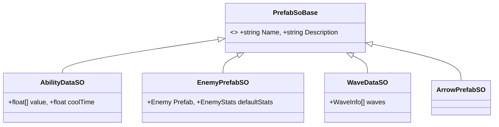

# [기술 문서] ScriptableObject 기반 데이터 주도 설계 및 관리 (Data & Prefab Management)

## 1. 시스템 개요 (System Overview)

* **기능 도입 배경:** 
  게임의 밸런스 데이터와 에셋 참조를 코드에서 분리하여 관리 효율을 높이기 위한 시스템입니다. 기획자가 코드 수정 없이 인스펙터 환경에서 수치를 조정하고 결과를 확인할 수 있는 환경을 마련하여 협업 생산성을 향상시키고자 했습니다.
  
* **구현 목표:**
  * **데이터 의존성 분리:** 수치 및 리소스 설정을 코드와 분리하여 관리의 편의성 확보.
  * **메모리 사용 최적화:** 동일한 데이터를 공유하는 인스턴스들이 단일 데이터 에셋(SO)을 참조하도록 설계.
  * **에셋 관리 일관성:** 프리팹 및 관련 리소스를 중앙 데이터베이스 형태로 구조화.

## 2. 시스템 구조 (Architecture)

모든 데이터는 `PrefabSoBase`를 상속받은 `ScriptableObject` 에셋 형태로 저장되며, 필요한 객체에서 이를 참조합니다.



**[구조 상세 설명]**
*   **데이터 원본 관리:** 모든 리소스 데이터의 최상위 클래스인 `PrefabSoBase`를 통해 이름, 설명 등 공통 필드를 일관되게 관리합니다.
*   **강한 형식의 데이터 컨테이너:** 능력(`AbilityDataSO`), 유닛(`EnemyPrefabSO`), 웨이브(`WaveDataSO`) 등 각 도메인에 특화된 SO 클래스를 설계하여 타입 안정성을 확보했습니다.
*   **에셋 참조의 직렬화:** 프리팹(GameObject), 스탯 데이터 등을 SO 내에 직접 포함시켜 유니티 엔진의 에셋 시스템을 통한 시각적인 관리가 가능하도록 했습니다.

## 3. 핵심 기능 및 동작 방식 (Core Logic)

### [데이터 참조 기반의 구조적 분리]
인스턴스화된 객체는 데이터 원본을 직접 소유하지 않고 SO를 참조합니다. 이를 통해 데이터 수정이 실시간으로 모든 객체에 적용되며, 메모리 효율성을 높일 수 있습니다.

```csharp
// 데이터 참조 활용 예시
public class Enemy : MonoBehaviour
{
    [SerializeField] private EnemyPrefabSO _dataSO; // 데이터 에셋 할당
    private float _currentHp;

    void Start()
    {
        // 원본 데이터는 보존하고 런타임 상태값만 별도 관리
        _currentHp = _dataSO.defaultStats.hp; 
    }
}
```

## 4. 고민과 선택 (Trade-offs)

| 비교 항목 | A안: 외부 데이터 파일 (JSON/CSV) | B안: 유니티 내장 에셋 (ScriptableObject) |
| :--- | :--- | :--- |
| **편집 방식** | 외부 편집기로 대량 수정이 용이하나 엔진 내 프리팹 연결이 불편함. | 인스펙터에서 직접 수정하고 에셋 참조(드래그앤드롭)가 용이함. |
| **안정성** | 에셋 경로를 문자열로 관리해야 하므로 휴먼 에러 발생 가능성이 있음. | 유니티의 에셋 관리 시스템을 통해 물리적 참조 관계가 보장됨. |
| **접근 속도** | 런타임에 파싱 및 변환 과정이 필요함. | 메모리에 로드된 객체를 직접 참조하므로 접근 속도가 빠름. |

*   **선택 이유:** **B안(ScriptableObject)**을 핵심 저장소로 선택했습니다. 유니티 엔진 환경에서 프리팹이나 사운드 등의 에셋을 데이터와 함께 관리하기에 가장 적합한 도구이기 때문입니다. 대량의 수치 데이터 편집이 필요한 경우에 대비하여 CSV 데이터를 SO로 변환해주는 자동화 도구를 병행하여 보완했습니다.

## 5. 회고 (Retrospective)

* **문제 인식:** 
  모든 데이터를 SO에 상주시킬 경우 데이터 규모에 따라 메모리 부담이 증가할 수 있으며, 런타임 중에 SO의 값을 직접 수정할 경우 원본 에셋이 변조될 위험이 있습니다.

* **향후 개선 방안:** 
  1. **Addressables 도입:** 필요한 데이터셋만 선별적으로 로드하여 메모리 관리를 고도화할 계획입니다.
  2. **복제본 생성 로직:** 런타임 중에 데이터 수정이 필요한 경우, 원본 SO의 인스턴스를 생성하여 사용하여 원본 데이터 오염을 방지할 예정입니다.
